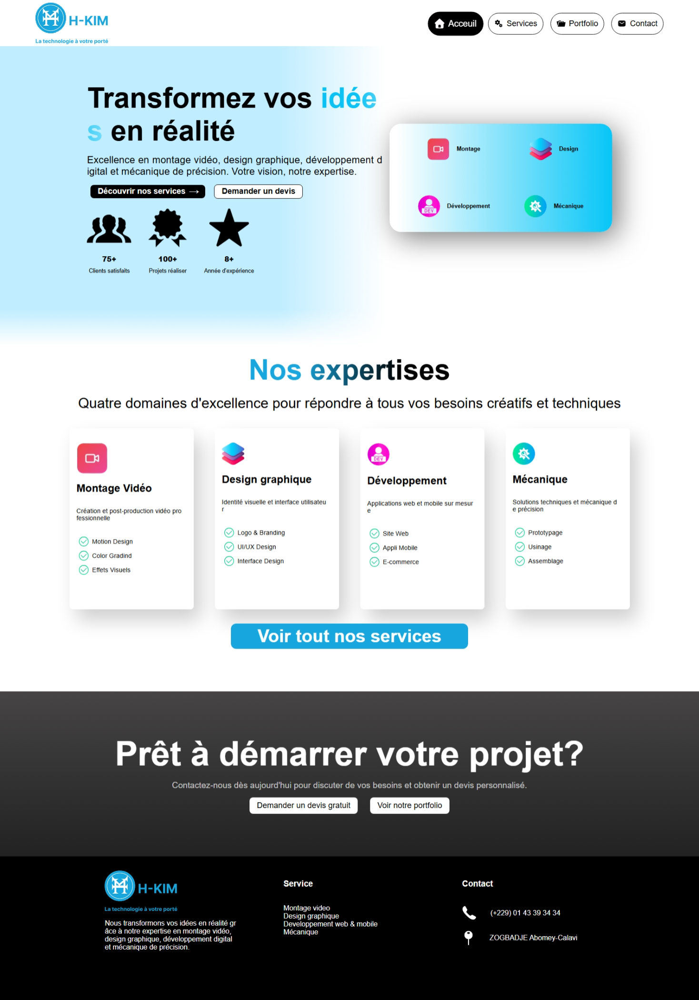
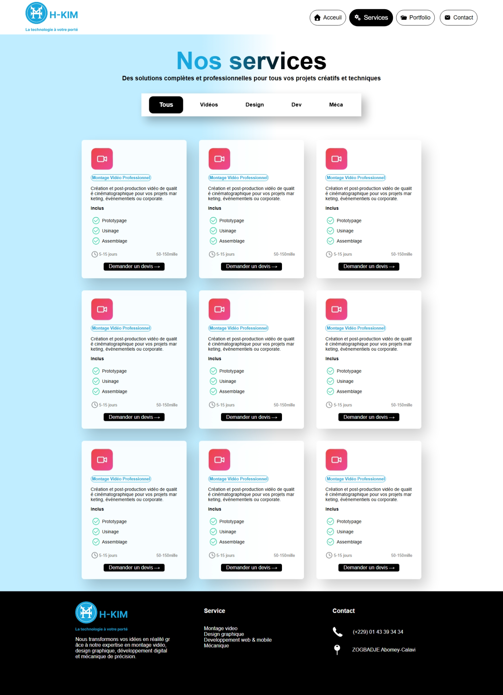
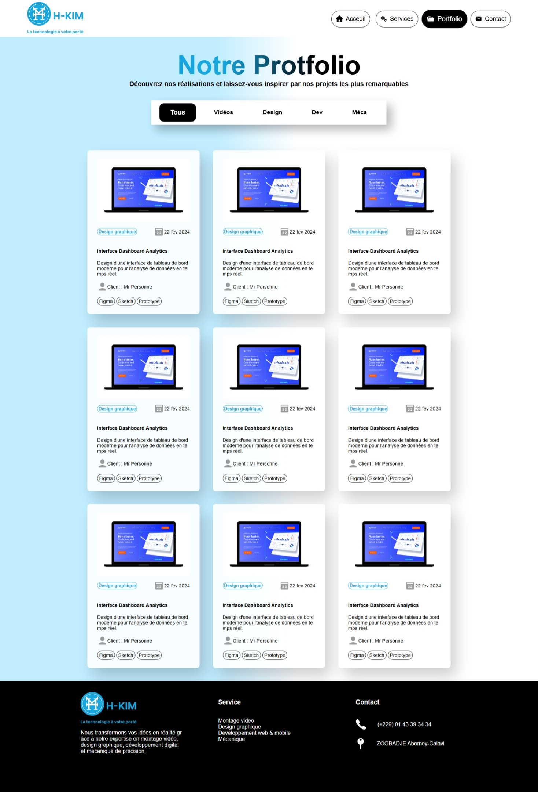

# HKIM — Site Vitrine

Site vitrine de l'entreprise **HKIM**, spécialisée dans quatre domaines :
le montage vidéo, le design graphique, le développement web & mobile,
et la mécanique de précision.

---

## Table des matières

1. [Aperçu du projet](#aperçu-du-projet)
2. [Structure des fichiers](#structure-des-fichiers)
3. [Pages](#pages)
4. [Architecture technique](#architecture-technique)
5. [Feuille de style (CSS)](#feuille-de-style-css)
6. [JavaScript](#javascript)
7. [Routing & .htaccess](#routing--htaccess)
8. [Assets](#assets)
9. [Deux versions du site](#deux-versions-du-site)
10. [Déploiement](#déploiement)
11. [Limitations connues & pistes d'amélioration](#limitations-connues--pistes-damélioration)

---

## Aperçu





---

## Aperçu du projet

HKIM est un site vitrine statique/dynamique conçu pour présenter les services,
le portfolio et les informations de contact de l'entreprise. Il est disponible
en **deux versions** :

| Version | Dossier | Technologie | Serveur requis |
|---------|---------|-------------|----------------|
| PHP (principale) | `/` (racine) | PHP + HTML + CSS + JS | Apache / Nginx avec PHP |
| HTML statique | `/HKIM html/` | HTML + CSS + JS | Tout serveur statique |

Les deux versions partagent la même feuille de style (`style.css`) et les
mêmes assets (`assets/`). Seule la gestion du lien de navigation actif diffère :
côté serveur en PHP, ou côté client en JavaScript.

---

## Structure des fichiers

```
HKIM/
│
├── index.php                  # Point d'entrée — redirige vers home
├── home.php                   # Page d'accueil
├── services.php               # Page des services
├── portfolio.php              # Page portfolio
│
├── head.php                   # Partial partagé : balise <head>
├── header.php                 # Partial partagé : navigation
├── footer.php                 # Partial partagé : pied de page
│
├── style.css                  # Feuille de style unique (toutes pages)
│
├── script.js                  # Animations hero + fonction redirect()
├── script2.js                 # Navigation responsive (masquage labels)
├── script_cards.js            # Clonage automatique des cartes
│
├── .htaccess                  # Réécriture d'URL (home au lieu de home.php)
|
├── screenshots/               # Aperçu en image
│   ├── home.png
│   ├── services.png
│   └── portfolio.png
├── assets/                    # Icônes, images et logo
│   ├── logo.png
│   ├── camera.png
│   ├── stack.png
│   ├── developer.png
│   ├── wrench-tool.png
│   ├── check.svg
│   ├── clock-line.svg
│   ├── home.svg
│   ├── letter.svg
│   ├── miscellaneous-services.svg
│   ├── portfolio.svg
│   ├── Phone.png
│   ├── Map Pin.png
│   ├── User.png
│   ├── Users.png
│   ├── Certificate.png
│   ├── Star.png
│   ├── Calendar 22.png
│   ├── Envelope.png
│   ├── File Explorer.png
│   ├── Home.png
│   ├── Administrative Tools.png
│   └── New Website Blue Mockup Instagram - Laptop 1.png
│
└── HKIM html/                 # Version HTML statique (sans PHP)
    ├── index.html
    ├── services.html
    ├── portfolio.html
    ├── page.js                # Détection lien actif (remplace logique PHP)
    ├── script_cards.js        # Clone des cartes (copie locale)
    └── .htaccess
```

---

## Pages

### Accueil (`home.php` / `index.html`)

La page principale du site. Elle est composée de trois sections :

**1. Section Hero**
- Titre principal avec le mot « idées » mis en valeur par un dégradé cyan.
- Sous-titre descriptif de l'activité.
- Deux boutons CTA :
  - *Découvrir nos services* → redirige vers `services`
  - *Demander un devis* → bouton non encore fonctionnel
- Trois statistiques clés : 75+ clients, 100+ projets, 8+ ans d'expérience.
- Une carte visuelle illustrant les quatre domaines (Montage, Design, Développement, Mécanique).
- Les deux blocs (texte et carte) apparaissent avec une animation décalée au chargement
  (géré par `script.js` : délai de 2,5 s pour le texte, 4 s pour la carte).

**2. Section Expertise**
- Titre et sous-titre de section.
- Grille de quatre cartes, une par domaine :
  - **Montage Vidéo** : Motion Design, Color Grading, Effets Visuels
  - **Design Graphique** : Logo & Branding, UI/UX Design, Interface Design
  - **Développement** : Site Web, Appli Mobile, E-commerce
  - **Mécanique** : Prototypage, Usinage, Assemblage
- Bouton *Voir tous nos services* → redirige vers `services`.

**3. Section CTA Footer**
- Bandeau sombre d'appel à l'action.
- Deux boutons : *Demander un devis gratuit* et *Voir notre portfolio*.

---

### Services (`services.php` / `services.html`)

Page listant les services proposés.

- **En-tête** : titre + description + barre de filtres par catégorie
  (Tous, Vidéos, Design, Dev, Méca). Le filtre actif est mis en surbrillance
  via la classe CSS `.actual`, mais le filtrage dynamique n'est pas encore implémenté.
- **Grille de cartes** : une seule carte est écrite en HTML (Montage Vidéo Professionnel),
  puis clonée 8 fois par `script_cards.js` pour simuler une grille complète.
  Chaque carte affiche : icône, titre, description, liste des prestations incluses,
  délai estimé, fourchette de prix et un bouton *Demander un devis*.

---

### Portfolio (`portfolio.php` / `portfolio.html`)

Page présentant les réalisations de l'entreprise.

- **En-tête** : même structure que la page Services (titre + filtres).
- **Grille de cartes** : une seule carte de démonstration (Interface Dashboard Analytics)
  clonée 8 fois. Chaque carte affiche : image illustrative, catégorie,
  date de réalisation, description, nom du client et badges d'outils utilisés.

---

## Architecture technique

### Système de partials PHP

La version PHP utilise trois fichiers inclus dans toutes les pages via `include` :

```php
<?php include "head.php";   ?>   // Balise <head> : charset, viewport, CSS
<?php include "header.php"; ?>   // Navigation avec détection de la page active
<?php include "footer.php"; ?>   // Pied de page : 3 colonnes
```

**Détection de la page active dans `header.php` :**

```php
$currentPage = basename($_SERVER['PHP_SELF']);
// Retourne "home.php", "services.php", etc.
```

Le lien correspondant reçoit alors la classe `actual` via un opérateur ternaire :

```php
<a href="home" class=<?= $currentPage == "home.php" ? 'actual' : '' ?>>
```

---

## Feuille de style (CSS)

Le fichier `style.css` (~1000 lignes) est organisé en 11 sections :

| # | Section | Description |
|---|---------|-------------|
| 1 | Debug | Règle commentée pour visualiser tous les éléments |
| 2 | Animations | `@keyframes` fadeIn, slideRight, slideLeft |
| 3 | Utilitaires | `.hide`, `.transparent-link`, `.slideRight`, `.slideLeft` |
| 4 | Styles de base | `body`, `h1`, `button`, `a` |
| 5 | Navigation | `header`, `#page_links`, liens actifs |
| 6 | Section Hero | `#hero-section`, cartes, boutons, statistiques |
| 7 | Section Expertise | `#expertise-section`, grille de cartes |
| 8 | Section CTA Footer | `#footer-section` |
| 9 | Pied de page | `#footer`, colonnes, icônes |
| 10 | Pages Services & Portfolio | `.main`, `.cards`, `.card`, `.category`, `.date`, etc. |
| 11 | Media Queries | Points de rupture : 1200px, 900px, 800px, 780px, 480px, 350px |

### Points de rupture responsive

| Largeur max | Changements principaux |
|-------------|------------------------|
| `1200px` | Expertise passe en 2 colonnes, hero réduit, cards 2 colonnes |
| `900px` | h1 réduit (3em), tailles de police réduites |
| `800px` | Hero passe en colonne (vertical), infos-hero centré |
| `780px` | Nav compressée, expertise 1 colonne, footer en colonne |
| `480px` | Petits mobiles : nav wrap, hero très compact |
| `350px` | Très petits écrans : carte hero en 1 colonne |

### Dégradés et couleurs principales

| Élément | Couleur / Dégradé |
|---------|-------------------|
| Fond `body` | `rgba(192, 237, 255)` → blanc (dégradé latéral) |
| Titres `h1` | Noir → `rgba(23, 166, 222)` (dégradé) |
| Bouton `.btn-1` | Fond noir, texte blanc |
| Bouton `.btn-2` | Fond blanc, bordure noire |
| Carte hero | Blanc → `rgba(7, 198, 247)` |
| Bouton *Voir tous nos services* | `rgba(23, 166, 222)` (bleu HKIM) |
| Section CTA Footer | `rgba(34,34,34)` → `rgba(70,68,68)` (sombre) |
| Footer | Fond noir, texte blanc |

---

## JavaScript

### `script.js` — Animations & navigation

Chargé uniquement sur `home.php` / `index.html`.

```js
// Au chargement de la page, les deux blocs hero sont d'abord cachés,
// puis animés en séquence.
document.body.onload = function () {
    infos_hero.style.opacity = 0;  // masquage initial
    card_hero.style.opacity  = 0;

    setTimeout(() => {
        infos_hero.className += " slideRight"; // glisse depuis la gauche
        infos_hero.style.opacity = 1;
    }, 2500);

    setTimeout(() => {
        card_hero.className += " slideLeft";   // glisse depuis la droite
        card_hero.style.opacity = 1;
    }, 4000);
};
```

```js
// Fonction de redirection utilisée par les boutons onclick
function redirect(text) {
    location.replace(text); // remplace l'entrée d'historique (pas de "retour arrière")
}
```

---

### `script2.js` — Navigation responsive

Masque les libellés texte des liens de navigation non actifs
quand la fenêtre est inférieure à 800 px.

```js
window.onresize = (e) => {
    if (window.innerWidth <= 800) {
        nav.forEach(a => {
            if (a.className !== 'actual') {
                a.lastElementChild.style.display = "none"; // cache le <span>
            }
        });
    }
};
```

> **Note :** ce script ne restaure pas les labels si la fenêtre est agrandie
> de nouveau. C'est une piste d'amélioration identifiée.

---

### `script_cards.js` — Clonage de cartes

Utilisé sur `services.php` et `portfolio.php`.

```js
// Clone la première carte (.card) 8 fois dans le conteneur (.cards)
for (let index = 0; index < 8; index++) {
    let a       = document.createElement("div");
    a.innerHTML = card.innerHTML; // copie du contenu
    a.className = "card";
    cards.appendChild(a);
}
```

> Ce mécanisme est une solution de démonstration. En production, les cartes
> devraient être générées dynamiquement depuis une base de données ou une API.

---

### `HKIM html/page.js` — Lien actif (version statique)

Équivalent JavaScript de la logique PHP de `header.php`.
Détecte le fichier courant depuis l'URL et applique la classe `actual`
au lien de navigation correspondant.

```js
const filename = path.substring(path.lastIndexOf('/') + 1);
// Ex : "services.html"

for (i = 0; i < page_links.length; i++) {
    const check = page_links[i].href.split('/');
    if (check[check.length - 1] === filename) {
        page_links[i].className = "actual";
    }
}
```

---

## Routing & .htaccess

Le fichier `.htaccess` (Apache) permet d'utiliser des URLs propres sans extension :

```
/home      au lieu de     /home.php
/services  au lieu de     /services.php
/portfolio au lieu de     /portfolio.php
```

**Contenu du `.htaccess` :**

```apache
RewriteEngine On

# Laisser passer les fichiers et dossiers existants
RewriteCond %{REQUEST_FILENAME} !-f
RewriteCond %{REQUEST_FILENAME} !-d

# Réécriture : /nom → /nom.php (ou .html)
RewriteRule ^([a-zA-Z0-9_-]+)$ $1.php [L]
RewriteRule ^([a-zA-Z0-9_-]+)$ $1.html [L]

# Gestion des slashs finaux : /nom/ → /nom
RewriteRule ^([a-zA-Z0-9_-]+)/$ $1 [L]
```

> **Prérequis :** le module `mod_rewrite` doit être activé sur Apache.
> Sur Nginx, une règle équivalente devra être ajoutée manuellement dans
> le bloc `server`.

---

## Assets

Tous les visuels sont dans le dossier `assets/`. Les chemins sont relatifs
à la racine du projet dans la version PHP, et préfixés `../` dans la version
HTML statique.

| Fichier | Usage |
|---------|-------|
| `logo.png` | Logo dans le header et le footer |
| `camera.png` | Icône domaine Montage Vidéo |
| `stack.png` | Icône domaine Design Graphique |
| `developer.png` | Icône domaine Développement |
| `wrench-tool.png` | Icône domaine Mécanique |
| `check.svg` | Icône de validation dans les listes de prestations |
| `clock-line.svg` | Icône délai dans les cartes service |
| `home.svg` | Icône lien Accueil dans la navigation |
| `miscellaneous-services.svg` | Icône lien Services dans la navigation |
| `portfolio.svg` | Icône lien Portfolio dans la navigation |
| `letter.svg` | Icône lien Contact dans la navigation |
| `Phone.png` | Icône téléphone dans le footer |
| `Map Pin.png` | Icône localisation dans le footer |
| `User.png` | Icône client dans les cartes portfolio |
| `Users.png` | Icône statistique clients (hero) |
| `Certificate.png` | Icône statistique projets (hero) |
| `Star.png` | Icône statistique expérience (hero) |
| `Calendar 22.png` | Icône date dans les cartes portfolio |
| `New Website Blue Mockup Instagram - Laptop 1.png` | Image d'illustration carte portfolio |
| `Envelope.png` | Réservé (non utilisé dans les pages actuelles) |
| `File Explorer.png` | Réservé (non utilisé dans les pages actuelles) |
| `Home.png` | Réservé (non utilisé dans les pages actuelles) |
| `Administrative Tools.png` | Réservé (non utilisé dans les pages actuelles) |

---

## Deux versions du site

Le projet contient deux versions fonctionnelles et indépendantes.

### Version PHP (dossier racine)

- Requiert un serveur Apache ou Nginx avec PHP activé.
- Les partials (`head.php`, `header.php`, `footer.php`) évitent la duplication
  de code entre les pages.
- La classe `actual` sur le lien de navigation est appliquée côté serveur
  via `basename($_SERVER['PHP_SELF'])`.
- `index.php` redirige automatiquement vers `home.php`.

### Version HTML statique (dossier `HKIM html/`)

- Peut être déployée sur n'importe quel hébergement statique
  (GitHub Pages, Netlify, Vercel, etc.) sans PHP.
- La navigation active est gérée par `page.js` côté navigateur.
- Les chemins vers les assets utilisent `../assets/` (un niveau en arrière).
- `script2.js` (navigation responsive) est chargé uniquement sur
  `services.html` et `portfolio.html`, où il est pertinent.

---

## Déploiement

### Version PHP (Apache)

1. Copier le contenu du dossier racine sur le serveur.
2. S'assurer que `mod_rewrite` est activé :
   ```bash
   sudo a2enmod rewrite
   sudo systemctl restart apache2
   ```
3. Vérifier que le `AllowOverride` est bien à `All` dans la configuration
   du virtual host :
   ```apache
   <Directory /var/www/html/HKIM>
       AllowOverride All
   </Directory>
   ```
4. Accéder au site via `http://votre-domaine/` (redirigé automatiquement vers `/home`).

### Version HTML statique

1. Copier le dossier `HKIM html/` sur l'hébergement statique.
2. Pointer le domaine sur `index.html`.
3. Pour GitHub Pages, pousser le dossier dans un dépôt public et activer Pages
   depuis les paramètres du dépôt.

---

## Limitations connues & pistes d'amélioration

| # | Limitation | Amélioration suggérée |
|---|------------|-----------------------|
| 1 | Les filtres de catégorie (Vidéos, Design, Dev, Méca) ne filtrent pas réellement les cartes | Ajouter un attribut `data-category` sur chaque carte et un listener JS sur les boutons de filtre |
| 2 | `script_cards.js` clone une seule carte statique | Charger les vraies données depuis une base de données ou un fichier JSON |
| 3 | `script2.js` masque les labels nav mais ne les restaure pas au redimensionnement vers le haut | Ajouter une condition `else` qui rétablit `display: ""` |
| 4 | `word-break: break-all` sur `body` coupe les mots français arbitrairement | Remplacer par `overflow-wrap: break-word` seul |
| 5 | La propriété `display: flex` est déclarée deux fois dans `#hero-section` | Supprimer le doublon |
| 6 | Padding malformé dans `header` : `.4rem 5rem.2rem 5rem` | Corriger en `.4rem 5rem .2rem 5rem` (espace manquant) |
| 7 | Les boutons *Demander un devis* ne font rien | Connecter à un formulaire de contact ou une page dédiée |
| 8 | Le lien *Contact* pointe sur `#` | Créer une page ou section contact |
| 9 | La version statique et la version PHP peuvent désynchroniser si l'une est modifiée sans l'autre | Passer à une seule version (recommandé : PHP) ou adopter un générateur de sites statiques |
| 10 | `lang="en"` sur `portfolio.php` et `portfolio.html` alors que le contenu est en français | Corriger en `lang="fr"` |

---

## Informations de contact (affichées sur le site)

- **Téléphone :** (+229) 01 43 39 34 34
- **Adresse :** ZOGBADJE, Abomey-Calavi